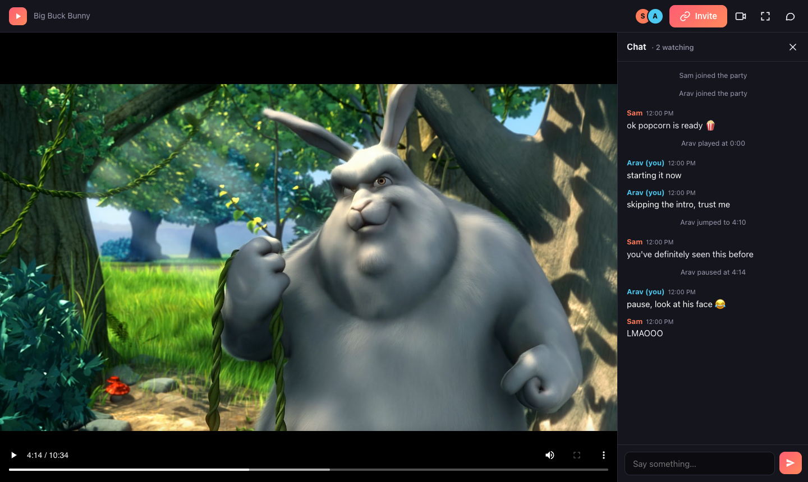
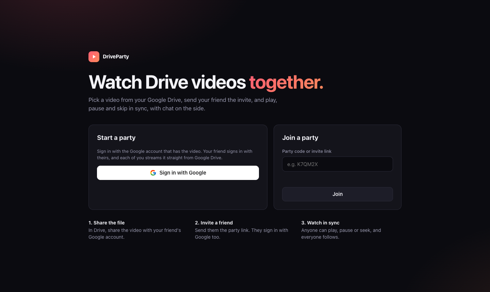

# 🍿 DriveParty

**Watch videos from your Google Drive together, perfectly in sync.**

Pick a video, send your friend a link, and hit play. When anyone pauses, skips or rewinds, everyone's screen follows, with a chat on the side for reacting in real time.

**[Try it → driveparty.onrender.com](https://driveparty.onrender.com)**

 

<i>Big Buck Bunny</i> © Blender Foundation, <a href="https://peach.blender.org">peach.blender.org</a>, CC BY 3.0

## Why DriveParty?

Watch-party tools work with Netflix and YouTube. But your family videos, class recordings, indie films and home movies live in **Google Drive**, and Drive has no way to watch together. DriveParty fills that gap.

- **Your videos stay private.** No uploading, no public links. Share the file with your friend in Drive like you normally would, and you each watch it through your own Google account.
- **Nothing to sign up for or install.** Sign in with the Google account you already have, right in your browser.
- **Anyone can take the remote.** Play, pause, scrub or skip ahead from either side, and everyone's player follows within a moment.
- **Chat without leaving the movie.** A sidebar you can hide with one key, and it stays visible in fullscreen.
- **Streams too.** Paste an HLS (`.m3u8`) stream link, or play an HLS video stored in Drive.

## How it works

<table>
<tr>
<td width="33%" valign="top">

### 1. Pick a video
Sign in with Google and choose any video from your Drive, or paste a link.

</td>
<td width="33%" valign="top">

### 2. Invite a friend
Share the video with them in Drive, then send the party link or 6-letter code.

</td>
<td width="33%" valign="top">

### 3. Watch together
They sign in, and you're in sync. Whoever presses play, everyone plays.

</td>
</tr>
</table>

## Features

| | |
|---|---|
| ⏯️ **Shared controls** | Play, pause and seek from any viewer, reflected for everyone instantly |
| 🎯 **Drift correction** | Quietly nudges any viewer who drifts out of sync back into step |
| 💬 **Live chat** | Toggleable sidebar with unread badges and pop-up previews when it's hidden |
| 🔗 **Easy invites** | Share a link or a short party code |
| 🔒 **Private by design** | DriveParty can only open the specific files you pick, never your whole Drive |
| 📺 **HLS streaming** | Plays `.m3u8` stream links and HLS videos stored in Drive |
| ⌨️ **Keyboard shortcuts** | `Space` play/pause · `←` `→` skip 10s · `C` chat · `F` fullscreen |

## Privacy

Your video goes **straight from Google Drive to each viewer's browser**, never through DriveParty's servers. The server only relays tiny messages: who pressed play, where they skipped to, and what they typed in chat.

When you sign in, Google asks you to let DriveParty open **only the files you choose**. DriveParty can't browse, edit or delete anything else in your Drive, and it doesn't keep a database of users. Parties and chat disappear an hour after everyone leaves.

## Good to know

- **Best formats:** MP4 (H.264) and WebM play everywhere. Some MKV files, and videos using HEVC video or AC3/DTS audio, won't play in browsers.
- **Browsers:** works best in desktop Chrome, Edge and Firefox. Other browsers and phones may vary.
- **Google accounts:** some school and work accounts block third-party apps. If yours does, use a personal Gmail.

## Built with

Node.js · Express · Socket.IO · hls.js · Google Identity Services · Google Drive & Picker APIs · Service Workers

Under the hood, a service worker streams video from the Drive API using each viewer's own sign-in, so seeking works like any normal video and hosting costs stay close to zero.

## Make your own

Want to run your own DriveParty? The **[Make Your Own guide](MAKEYOUROWN.md)** covers Google Cloud setup, running locally, deploying to Render, and a deeper look at how syncing and streaming work.
